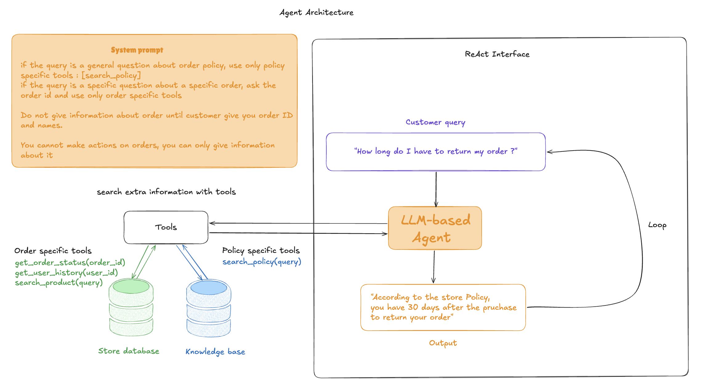

  
Academic Project · June 2026

  <h1 class="text-6xl font-bold leading-tight text-gray-900 max-w-2xl">
    ShopEase Customer Support Agent
  </h1>
  

    Automating common e-commerce support queries with a LangGraph ReAct agent
  

  

    FastAPI
    LangGraph
    ChromaDB
    GPT-4o-mini
    PostgreSQL
  

---
layout: center
class: text-center
---

# Outline

  

    
01

    
Problem & Approach

    
Why this agent, and what it does

  

  

    
02

    
Architecture

    
Stack, agent design, and data flow

  

  

    
03

    
Evaluation

    
30 scenarios across 3 categories

  

  

    
04

    
Limitations & Next Steps

    
What the system can't do yet

  

---
layout: center
class: text-center
---

  
01

  <h1>Problem & Approach</h1>

---

# Support teams spend most of their time on the same questions

Not every support ticket needs a human.

  

    <h3 class="font-semibold text-gray-700 mb-4">What customers actually ask</h3>
    

      

        <mdi-package-variant-closed class="text-indigo-400 text-xl" />
        "Where is my order A12345?"
      

      

        <mdi-arrow-u-left-bottom class="text-indigo-400 text-xl" />
        "How do I return a sale item?"
      

      

        <mdi-shield-outline class="text-indigo-400 text-xl" />
        "What warranty does my laptop have?"
      

      

        <mdi-airplane class="text-indigo-400 text-xl" />
        "Do you ship to Europe?"
      

    

  

  

    <h3 class="font-semibold text-gray-700 mb-4">What these have in common</h3>
    

      

        ✓
        The answer comes from a policy document or a database, not judgment
      

      

        ✓
        No human decision is needed — just retrieval
      

      

        ✓
        Customers want an answer in seconds
      

    

    

      An LLM that can search policy documents and query a database can handle most of these automatically — without a human in the loop.
    

  

---

# What we built

ShopEase is a fictional online store with a fully integrated AI support chat.

  

    <h3 class="font-semibold text-gray-700 mb-4">The application</h3>
    

      

        →
        194 products with categories, cart, and checkout
      

      

        →
        Order tracking with automatic lifecycle advancement every 30 seconds
      

      

        →
        JWT auth with two modes: guest and authenticated
      

      

        →
        Streamed chat with a real-time tool-call panel
      

    

  

  

    <h3 class="font-semibold text-gray-700 mb-4">Stack</h3>
    

      

        Frontend
        <code class="text-xs bg-gray-100 px-2.5 py-1 rounded-md text-gray-700">React 18 + Vite + Tailwind</code>
      

      

        Backend
        <code class="text-xs bg-gray-100 px-2.5 py-1 rounded-md text-gray-700">FastAPI + async SQLAlchemy</code>
      

      

        Database
        <code class="text-xs bg-gray-100 px-2.5 py-1 rounded-md text-gray-700">PostgreSQL 16</code>
      

      

        Vector store
        <code class="text-xs bg-gray-100 px-2.5 py-1 rounded-md text-gray-700">ChromaDB + text-embedding-3-small</code>
      

      

        Agent
        <code class="text-xs bg-gray-100 px-2.5 py-1 rounded-md text-gray-700">LangGraph ReAct + GPT-4o-mini</code>
      

      

        Alt. LLM
        <code class="text-xs bg-gray-100 px-2.5 py-1 rounded-md text-gray-700">Ollama + Qwen Coder Instruct</code>
      

    

  

---
layout: center
class: text-center
---

  
02

  <h1>Architecture</h1>

---

# System architecture

  

  

    The agent runs a <strong class="text-gray-700">ReAct loop</strong> — reason about the message, call a tool, reason about the result, repeat until it has enough to respond.
  

---

# Agent design

  

    <h3 class="font-semibold text-gray-700 mb-4">Two user modes</h3>
    

      

        
Guest

        
Policy search, product search, product lookup by ID. No order access.

      

      

        
Authenticated

        
All guest tools + order status lookup + full order history.

      

    

    

      <strong>User scoping:</strong> order tools are built via closure at request time. The <code>user_id</code> is captured inside the function — never passed as an argument. Querying another user's data isn't a validation problem; it's structurally not possible.
    

  

  

    <h3 class="font-semibold text-gray-700 mb-4">Routing (from the system prompt)</h3>
    

      
# policy, shipping, returns, payments

      
→ search_policy(query)

      
# "do you sell X?", product search

      
→ search_products(query)

      
# "show my orders"

      
→ get_order_history()

      
# "where is order A12345?"

      
→ get_order_status(order_id)

      
# "cancel my order / refund me"

      
→ escalate to human

    

  

---

# Tools and data sources

| Tool | Access | Source | Detail |
|------|--------|--------|--------|
| `search_policy(query)` | Guest + Auth | ChromaDB | 7 policy docs · top-3 chunks |
| `search_products(query)` | Guest + Auth | ChromaDB | 194 products · top-5 results |
| `get_products_by_id(ids)` | Guest + Auth | PostgreSQL | Direct ID lookup · includes stock |
| `get_order_status(order_id)` | Auth only | PostgreSQL | User-scoped · carrier + ETA |
| `get_order_history()` | Auth only | PostgreSQL | All orders · most-recent first |

  

    <strong class="text-indigo-800">ChromaDB</strong>
    

      Policy documents and product descriptions embedded at startup with <code>text-embedding-3-small</code>. Similarity search at query time.
    

  

  

    <strong class="text-emerald-800">PostgreSQL</strong>
    

      Three tables: Users, Products, Orders. A background job advances each order one stage every 30 seconds — from <code>created</code> to <code>delivered</code>.
    

  

---
layout: center
class: text-center
---

  
03

  <h1>Evaluation</h1>

---

# Evaluation approach

  <h3 class="font-semibold text-gray-700 mb-4">What we measure</h3>
  

    

      <strong>Tool selection</strong> — did the agent call the expected tool?
      
Deterministic: binary pass / fail per scenario.

    

    

      <strong>Behavioral correctness</strong> — did it ask for a missing order ID? Did it escalate when it couldn't help?
      
Checked with keyword matching on the final response.

    

    

      <strong>No hallucination</strong> — did the agent invent information when tools returned nothing?
      
Verified by checking the response is non-empty and grounded in tool output.

    

  

  <h3 class="font-semibold text-gray-700 mb-4">How the harness works</h3>
  

    
The script loads 30 scenarios from <code>scenarios.json</code>, sends each conversation to the live <code>/api/v1/chat/stream</code> endpoint, and collects the streamed tool calls and final text.

    
Each scenario specifies the expected tool, expected behavior, and whether escalation should trigger.

    

      # Run all 30 scenarios 
      python tests/eval.py --token "$TOKEN"  
      # Filter by category 
      python tests/eval.py --token "$TOKEN" \ 
      &nbsp;&nbsp;--category policy
    

  

---

# 30 scenarios across 3 categories

Policy · 12 scenarios

  
Return window — 30 days

  
Sale items → store credit only

  
International shipping zones

  
Free shipping at $50

  
Payment methods + BNPL

  
Laptop warranty (1 year)

  
Non-returnable items

  
Data deletion rights

Order · 12 scenarios

  
Lookup with valid order code

  
Missing ID → agent asks first

  
Multi-turn ID collection

  
Non-existent order code

  
Tracking number + ETA

  
Lowercase code handling

  
Two orders in one message

  
Cross-user access denial

Escalation · 6 scenarios

  
Cancel subscription + refund

  
Process a refund immediately

  
Modify a shipping address

  
Off-topic request (poem)

  
Explicit human agent request

  
Fraud / account compromise

---

# What the evaluation misses

Deterministic testing covers tool selection reliably. Response quality is a harder problem.

<h3 class="font-semibold text-gray-700 mb-3">What's reliable</h3>

  

    ✓
    The agent called <code>search_policy</code> — or didn't
  

  

    ✓
    The response contains "escalating" when it should
  

  

    ✓
    The agent asked for an order ID before calling the order tool
  

  

    ✓
    The response was non-empty
  

<h3 class="font-semibold text-gray-700 mb-3">What it misses</h3>

  

    ✗
    Did it quote the correct return window (30 days), or just some policy text?
  

  

    ✗
    Was the response clear, or technically accurate but confusing?
  

  

    ✗
    Did it give the right carrier and ETA, or just a valid-looking response?
  

  Closing this gap requires a second evaluation pass: either human review or LLM-as-a-Judge with a reference answer per scenario.

---
layout: center
class: text-center
---

  
04

  <h1>Limitations & Next Steps</h1>

---

# Limitations

  
<mdi-currency-usd class="text-2xl text-red-400" />

  

    
Cost at scale

    

      GPT-4o-mini charges per token. That's negligible in a demo, but at real support volume it compounds. Switching to an open-source model via Ollama removes the per-token cost — but open-source models are less consistent at following instructions, particularly for multi-step reasoning. Both options are in the codebase; the trade-off is real.
    

  

  
<mdi-lock-outline class="text-2xl text-orange-400" />

  

    
Security

    

      The system prompt sets guardrails, but LLMs can be manipulated through prompt injection. A malicious message could try to override the agent's behavior. The agent also has access to full order history, which makes a successful jailbreak more damaging than it would be on a stateless chatbot.
    

  

  
<mdi-clipboard-list-outline class="text-2xl text-blue-400" />

  

    
Read-only scope

    

      The agent retrieves information but cannot take action. Refunds, cancellations, and address changes still need a human. This was intentional — a write-capable agent needs much more careful guardrails — but it limits how much of the support queue it can actually close.
    

  

---

# Next steps

  

    
Agentic actions

    

      Give the agent tools to cancel eligible orders or initiate returns, with a confirmation step before committing. This would close the gap between "explaining the refund policy" and "starting the refund."
    

  

  

    
Open-source model benchmark

    

      Run the full 30-scenario suite against Qwen and Llama via Ollama. Get concrete numbers on how much accuracy changes when you remove the per-token cost. The gap probably varies across scenario categories.
    

  

  

    
LLM-as-a-Judge

    

      Add a second LLM call that reads the agent's response and the expected answer, then scores it for accuracy and completeness. This directly addresses the quality gap that keyword-based checks can't reach.
    

  

  

    
Session memory

    

      The current implementation sends the full conversation history on each request but doesn't persist across page reloads. A session store would let customers continue interrupted conversations without repeating themselves.
    

  

---
layout: center
class: text-center
---

# The Team

  

    
    

      
Raounek Zeghdoud

      
Mines Paris – PSL

    

  

  

    

      <svg viewBox="0 0 100 100" xmlns="http://www.w3.org/2000/svg" class="w-full h-full">
        <rect width="100" height="100" fill="#f1f5f9"/>
        <circle cx="50" cy="37" r="19" fill="#cbd5e1"/>
        <ellipse cx="50" cy="85" rx="30" ry="23" fill="#cbd5e1"/>
      </svg>
    

    

      
Nada Alrehaili

      
University of Liverpool

    

  

  

    
    

      
Solène Delourme

      
CentraleSupélec

    

  

  

    
    

      
Antonio Zaitoun

      
University of Haifa

    

  

  

    
    

      
Donatas Iliška

      
Kaunas University of Technology

    

  

---
layout: center
class: text-center
---

  
Thank you

  
Questions?

  

    

      
Backend

      
FastAPI + LangGraph

    

    

      
Frontend

      
React + Tailwind

    

    

      
Agent

      
GPT-4o-mini · ReAct

    

  

